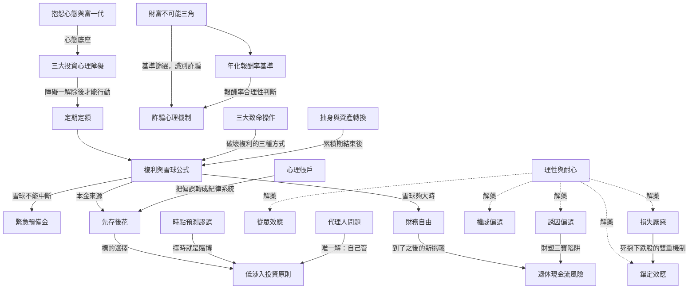

## 用途

這頁不是課程大綱的複製，而是從**學習者視角**回答：「這些概念彼此怎麼連？哪個要先懂才能懂另一個？」

課程完整架構見 [[wiki/entities/reframe重塑財商概念.md]]。

---

## 概念依存圖



> **虛線箭頭**（`-..->`）= 「解藥」關係：理性與耐心是模組四所有偏誤的認知解藥，但不能直接阻止偏誤，只能提高識別率。
> **實線箭頭** = 「前置/延伸」關係：先理解前者才能正確運用後者。

---

## 三條學習弧線

### 弧線一：心態 → 工具 → 偏誤預防接種

這是課程最主要的縱向敘事。

```
不開始（心理障礙）
  ↓ 打破後
開始投資（定期定額 + 複利）
  ↓ 有了行動才需要
操作原則（先存後花 / 低涉入 / 時點謬誤）
  ↓ 有了原則才需要識別
行為偏誤（八個偏誤：哪些力量會讓人偏離原則）
  ↓ 知道偏誤之後才能
定義終點與防禦（財務自由 + 退休風險）
```

**關鍵洞見**：模組四（行為偏誤）放在模組三（操作原則）之後，是刻意設計——先給「應該怎麼做」，再告訴你「哪些力量會讓你做不到」。反過來就沒有施力點。

### 弧線二：視角從小到大

| 模組 | 視角 | 核心問題 |
|------|------|---------|
| 模組一二 | 個人視角 | 「我為什麼不開始 / 我怎麼被騙」 |
| 模組三 | 市場視角 | 「市場的規律是什麼，我該怎麼與它互動」 |
| 模組四 | 行為視角 | 「機構與市場如何利用我的心理弱點」 |
| 模組五 | 制度視角 | 「政策、通膨、人口結構這些外力如何侵蝕財富」 |

這個遞進說明：個人心態問題解決後，接著要面對的是市場問題，再來是制度問題。課程的「坑」越來越大、越來越難控制。

### 弧線三：累積期 → 提領期

課程絕大多數篇幅（模組一至模組四 + 5-1 前段）處理的都是**累積期**問題：「如何讓錢變多、不被中斷」。

**5-2 是轉折點**——第一次正視「累積完了之後」的問題，引入**提領期**視角。

```
累積期的敵人              提領期的敵人
─────────────────         ─────────────────
過度交易（心理帳戶）        通膨侵蝕（CPI 低估）
賭徒心態（三大障礙）        對手方違約（馬多夫）
不開始（拖延）              政策縮水（公教18%）
時點賭運（時點謬誤）        結構變遷（少子化）
集中單押（財塑三寶←）       ←同一個偏誤，不同階段，不同災難
```

「財塑三寶案例」是最佳例證：誘因偏誤（追高股息）在累積期損失機會成本，在提領期導致本金真實蒸發。

---

## 這頁與其他 Synthesis 的分工

| Synthesis | 聚焦 |
|-----------|------|
| [[wiki/syntheses/散戶致敗的心理路徑.md]] | 模組四：八個偏誤如何形成一條「從入場到歸零」的心理路徑（橫向連結） |
| [[wiki/syntheses/投機者破產警世錄.md]] | 模組三：大咖為何破產（歷史佐證，縱向案例） |
| [[wiki/syntheses/0050定期定額真實歷史試算.md]] | 模組一三：複利與定期定額的量化驗證 |
| **本頁** | 全課程：概念之間的依存關係與學習順序（結構圖） |

---

## 來源

（見 frontmatter sources，全部 18 篇 raw 素材）
