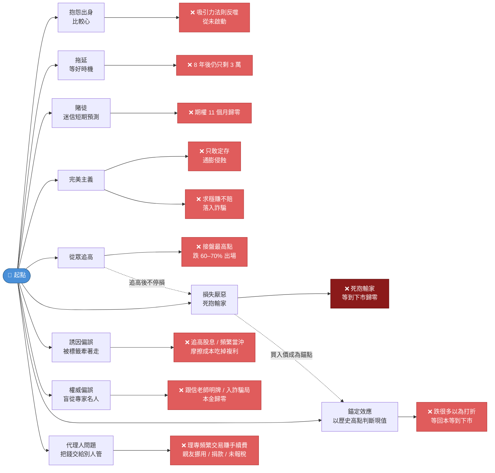

## 主題

橫跨三篇素材，講者描繪了一張「散戶心理地圖」：每一條岔路都通往不同的失敗，但根源都是**心態**而非市場。

## 心理地圖

概念連結：[[wiki/concepts/抱怨心態與富一代.md]] · [[wiki/concepts/三大投資心理障礙.md]] · [[wiki/concepts/詐騙心理機制.md]] · [[wiki/concepts/從眾效應.md]] · [[wiki/concepts/損失厭惡.md]] · [[wiki/concepts/誘因偏誤.md]] · [[wiki/concepts/權威偏誤.md]] · [[wiki/concepts/錨定效應.md]] · [[wiki/concepts/代理人問題.md]]

## 三條共同的解

1. **行動 > 知識**：從小金額開始 [[wiki/concepts/定期定額.md]]，不擇時。
2. **錨定理性基準**：用 [[wiki/concepts/年化報酬率基準.md]]（12–13%）篩掉所有違反 [[wiki/concepts/財富不可能三角.md]] 的「機會」。
3. **心態重構**：把「沒含金湯匙」轉成富一代驅動力，而非抱怨借口（[[wiki/concepts/抱怨心態與富一代.md]]）。
4. **物理底盤**：[[wiki/concepts/緊急預備金.md]]——6–12 個月生活費保底，讓上述 3 條紀律不會在市場震盪時被現金壓力擊穿。

## 從眾 × 損失厭惡的致命組合

4-2 與 4-3 揭示了一個特別危險的雙向陷阱：

- **進場時**：從眾效應讓人在消息最廣泛流傳時追高買入（最高點接盤）。
- **持有時**：損失厭惡讓人無法在虧損擴大時停損，甚至補錯加碼攤平。
- **結局**：市場最終以下市、斷頭、強制清算的方式「替人決定」——代價遠大於主動停損。

兩者結合等於「**高點買、底部抱、強制清算離場**」——是 2.8 萬人沒贖回元大石油正2、3.7 萬人被套華晨的共同模式（[[raw/4-3 損失厭惡：越怕賠，越會賠！.md]]、[[raw/4-2 從眾效應：別做跟著跳崖的羊.md]]）。

## 一個沒被素材直接連起來、但值得追問的觀察

- 「**急**」是貫穿三篇的隱性主角：急於補償出身、急於翻倍、急於避開所有虧損。詐騙集團獵捕的不是貪婪，而是「急」。
- 開放問題：講者後續素材是否有針對「如何降低急迫感」的具體方法（冥想、財務規劃時長、生涯腳本）？尚無素材回答。
- **2026-04-28 更新**：2-3 提供了「降低急迫感」的部分答案——[[wiki/concepts/理性與耐心.md]] 雙引擎 + [[wiki/concepts/複利與雪球公式.md]]（讓人接受「99.9% 財富在 50 歲後」這個時間結構）；3-1 則把「急」具體外顯成 [[wiki/concepts/三大致命操作.md]]（過度槓桿 / 追明牌 / 動用急用金）。
- 新增的內部風險面向：[[wiki/concepts/戀愛腦風險.md]]——非市場、非貪婪，而是情感失控導致的紀律崩潰。
- 歷史對照：[[wiki/syntheses/投機者破產警世錄.md]] 證明「急 + 槓桿」連百年級的天才也會被吞噬。

## 來源

- [[raw/1-1 没開始、賭運氣、想全贏.md]]
- [[raw/2-1 停止抱怨！投錯胎也能成為富一代.md]]
- [[raw/2-2 急著賺錢，只會遇到詐騙.md]]
- [[raw/2-3 兩個小招數讓你擁有理財情商.md]]
- [[raw/3-1 不要用「一定掛」的觀念投資.md]]
